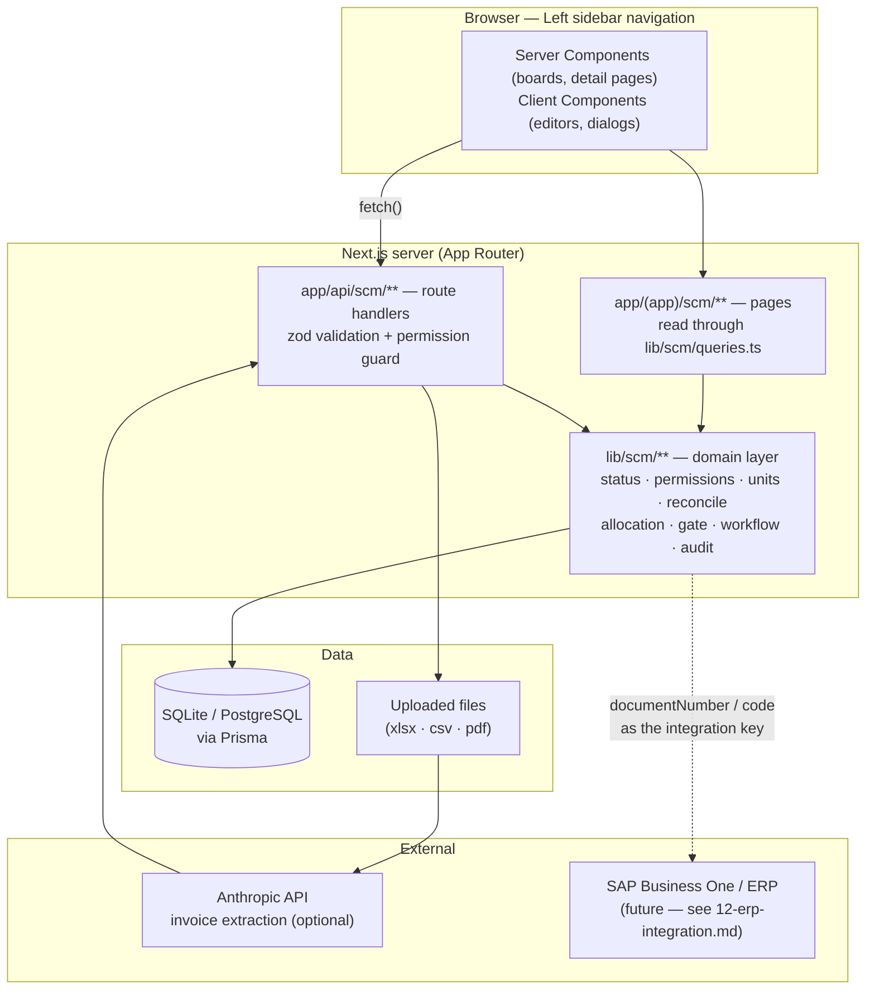
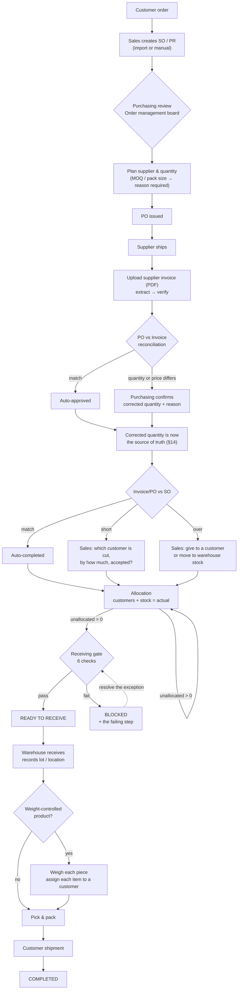
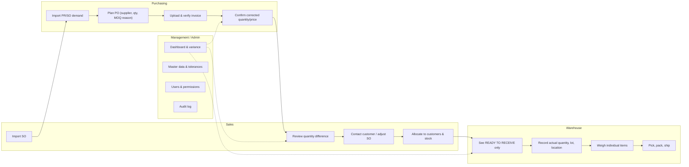
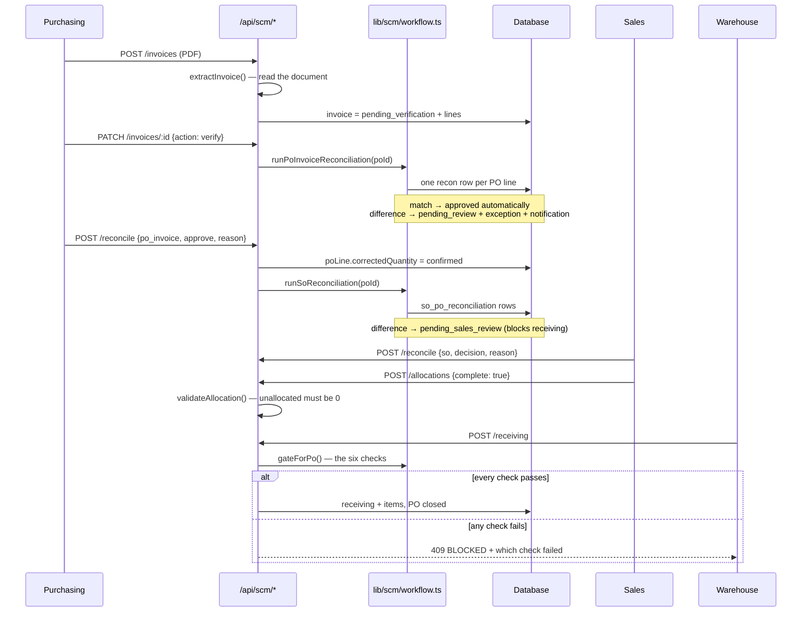

# 1. System Architecture & Process Flow

## 1. System architecture

โมดูลนี้ต่อยอดบนแอป Kaviari Cellar เดิม (Next.js App Router + Prisma) โดยใช้
ฐานข้อมูล, ระบบล็อกอิน, ธีมและ product master ร่วมกัน ไม่ได้แยกเป็นอีกระบบหนึ่ง

### ชั้นของระบบ (Layers)

| Layer | หน้าที่ | ไฟล์ |
|---|---|---|
| **Presentation** | หน้าจอ 16 หน้า, sidebar แยกตามแผนก | `app/(app)/scm/**`, `components/scm/**` |
| **API** | รับคำสั่งเปลี่ยนสถานะ ตรวจสิทธิ์และ validate ด้วย zod | `app/api/scm/**` |
| **Domain** | กฎธุรกิจทั้งหมด เป็นฟังก์ชันบริสุทธิ์ที่ทดสอบได้ | `lib/scm/*.ts` |
| **Persistence** | Prisma models 23 ตาราง | `prisma/schema.prisma` |
| **Integration** | อ่านไฟล์ Excel/CSV/PDF, เรียก AI สำหรับ Invoice | `lib/scm/import/**`, `lib/import/parse.ts` |

### ทำไมกฎธุรกิจต้องอยู่ในชั้น Domain

หน้าจอ, API และ Dashboard ต้องตอบคำถามเดียวกันให้ตรงกันเสมอ เช่น
"PO ใบนี้พร้อมรับของหรือยัง" — ถ้าแต่ละที่คำนวณเอง ระบบจะขัดแย้งกันเอง
`evaluateGate()` จึงเป็นฟังก์ชันเดียวที่ทั้งสามที่เรียกใช้ และ
`app/api/scm/receiving/route.ts` เรียกซ้ำก่อนบันทึกเสมอ แม้หน้าจอจะซ่อนปุ่มไว้แล้ว

### Security

- Session: HMAC-signed cookie (ของเดิม) → `getCurrentUser()`
- Authorization: `lib/scm/permissions.ts` — matrix ตามแผนก
  ทุก route handler เรียก `requirePermission()` ก่อนทำงาน
- Audit: `lib/scm/audit.ts` เขียนทุกการเปลี่ยนแปลงพร้อม user/reason
- Input: zod schema ทุก endpoint; ไฟล์อัปโหลดจำกัดขนาดและนามสกุล

---

## 2. Process Flow Diagram

### ภาพรวม (§18 Main workflow)

### ใครทำอะไร (Swimlane)

### ลำดับเวลาแบบละเอียด (Sequence — invoice ถึง receiving)

