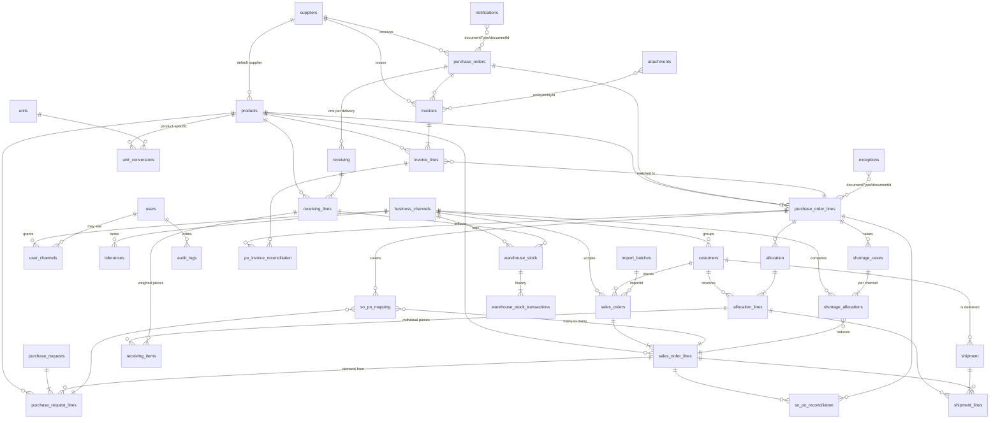

# 2. Database ER Diagram & Data Dictionary

## 1. ER Diagram



### เส้นทางความสัมพันธ์หลัก (§37 Document relationship)

```
Business Channel → Customer → sales_orders → sales_order_lines
                              ↓ (purchase_request_lines.soLineId)
                          purchase_request_lines
                              ↓ (so_po_mapping — many-to-many)
                          purchase_order_lines → purchase_orders → suppliers
                              ↓                        ↓
                          invoice_lines ← invoices ────┘
                              ↓
                          po_invoice_reconciliation → correctedQuantity
                              ↓
                          so_po_reconciliation → sales decision
                              ↓
                          allocation → allocation_lines ─┬→ customers
                              ↓                          └→ warehouse_stock → transactions
                          receiving → receiving_lines → receiving_items (per-piece weight)
                              ↓
                          shipment → shipment_lines → Customer
```

`lib/scm/trace.ts` เดินเส้นทางนี้จาก PO, SO หรือ PR ก็ได้ แล้วคืนทุก node
พร้อมสถานะ — หน้า `/scm/trace/[type]/[id]` แสดงผลตรงนี้

---

## 2. Data Dictionary

> ทุกตารางมี `id` (cuid) เป็น PK และ `createdAt`/`updatedAt` เว้นแต่ระบุเป็นอย่างอื่น
> ชื่อในวงเล็บคือชื่อ Prisma model, ชื่อหัวข้อคือชื่อตารางจริง (`@@map`)

### 2.0 Organisation

#### `business_channels` (BusinessChannel)

| Field | Type | Null | คำอธิบาย |
|---|---|:--:|---|
| `code` | String | – | `FS` \| `RTL` \| `STR` \| `CK` \| … — **unique** |
| `name` / `nameTh` | String | –/✓ | ชื่ออังกฤษ / ไทย |
| `sortOrder` | Int | – | ลำดับที่แสดงบนหน้าจอ |
| `defaultPriority` | Int | – | ลำดับที่ **เสนอ** เมื่อของไม่พอ (ค่าน้อย = ได้ก่อน) |
| `active` | Boolean | – | ปิดแทนการลบ — เอกสารเก่ายังชี้มาที่นี่ |

**การเพิ่ม channel ใหม่ = insert 1 แถว** ไม่มี migration ไม่มีการแก้โค้ด

#### `user_channels` (ScmUserChannel)

| Field | Type | คำอธิบาย |
|---|---|---|
| `userId` / `channelId` | FK | **unique ร่วมกัน** |

Sales Manager ใช้ `users.allChannels = true` แทนการติ๊กทุก channel เพื่อให้
channel ที่เพิ่มภายหลังครอบคลุมอัตโนมัติ

#### `departments` / `roles` (ScmDepartment / ScmRole)

ตาราง lookup สำหรับ label บนหน้าจอ — **ตั้งใจไม่เป็น Foreign Key** เพราะ
`User.department` ต้องอ่านได้แม้ฐานข้อมูลจะยังไม่มีแถวนั้น รหัสที่ไม่รู้จัก
จะแสดงเป็นตัวมันเอง

#### `tolerances` (ScmTolerance)

| Field | Type | Null | คำอธิบาย |
|---|---|:--:|---|
| `scope` | String | – | `global` \| `product_type` \| `supplier` \| `channel` |
| `key` | String | – | `"<scope>:<target|*>"` — **unique** หนึ่งกฎต่อเป้าหมาย |
| `productType` / `supplierId` / `channelId` | | ✓ | เป้าหมายตาม scope |
| `qtyTolerancePct` / `priceTolerancePct` / `weightTolerancePct` | Float | – | เกณฑ์ที่ถือว่า "ตรง" |
| `note` / `active` | | | |

**ลำดับการเลือกกฎ:** supplier → channel → product type → global

### 2.1 Master data

#### `suppliers` (Supplier)

| Field | Type | Null | คำอธิบาย |
|---|---|:--:|---|
| `code` | String | – | รหัส Supplier — **unique**, ใช้เป็นคีย์ในไฟล์นำเข้า |
| `name` | String | – | ชื่อ Supplier |
| `currency` | String | – | สกุลเงินตั้งต้น (EUR/THB/USD) |
| `defaultUnit` | String | – | หน่วยซื้อตั้งต้น |
| `moq` | Float | ✓ | ขั้นต่ำการสั่งของ Supplier |
| `leadTimeDays` | Int | ✓ | Lead time (วัน) |
| `contactEmail` / `contactPhone` / `address` | String | ✓ | ข้อมูลติดต่อ |
| `active` | Boolean | – | ปิดการใช้งานแทนการลบ |

#### `customers` (Customer)

| Field | Type | Null | คำอธิบาย |
|---|---|:--:|---|
| `code` | String | – | รหัสลูกค้า — **unique** |
| `name` / `nameTh` | String | –/✓ | ชื่อลูกค้า อังกฤษ/ไทย |
| `channelId` | FK business_channels | ✓ | **Business Channel ที่ลูกค้าสังกัด (§3)** |
| `deliveryLocation` | String | ✓ | สถานที่ส่งของ |
| `salesOwner` | String | ✓ | Sales ผู้ดูแล |
| `active` | Boolean | – | |

#### `units` (ScmUnit)

| Field | Type | คำอธิบาย |
|---|---|---|
| `code` | String **PK** | KG, G, PC, TIN, BOX, CARTON, PACK, CASE, PK |
| `name` | String | ชื่อเต็ม |
| `dimension` | String | `weight` \| `count` \| `volume` — หน่วยต่างมิติแปลงกันไม่ได้ |

#### `unit_conversions` (ScmUnitConversion)

| Field | Type | Null | คำอธิบาย |
|---|---|:--:|---|
| `key` | String | – | `"<productId\|*>:<FROM>:<TO>"` — **unique** (SQLite ถือว่า NULL ต่างกันเสมอ จึงรวม scope ไว้ในคีย์เดียว) |
| `productId` | FK products | ✓ | null = ใช้ได้กับทุกสินค้า |
| `fromUnit` / `toUnit` | String | – | |
| `factor` | Float | – | `quantity(to) = quantity(from) × factor` |

#### `products` (Product — ตารางเดิม เพิ่ม field)

| Field ที่เพิ่ม | Type | Null | คำอธิบาย |
|---|---|:--:|---|
| `nameTh` | String | ✓ | ชื่อสินค้าไทย |
| `purchaseUnit` | String | ✓ | หน่วยซื้อ เมื่อต่างจากหน่วยคลัง |
| `purchaseConversion` | Float | ✓ | 1 BOX = 12 Tin ⇒ 12 |
| `moq` | Float | ✓ | ขั้นต่ำการสั่ง (หน่วยซื้อ) |
| `defaultSupplierId` | FK suppliers | ✓ | Supplier ตั้งต้น |
| `weightControlled` | Boolean | – | `true` = ชั่งทีละชิ้น (ปลา/ปู/กุ้ง) |
| `lotRequired` | Boolean | – | รับของไม่ได้ถ้าไม่กรอก Lot/Batch |
| `expiryRequired` | Boolean | – | รับของไม่ได้ถ้าไม่กรอกวันหมดอายุ |

Field เดิมที่โมดูลนี้ใช้: `prCode` (รหัสสินค้า), `name`, `category` (ประเภทสินค้า),
`unit` (หน่วยคลัง — เป็นหน่วยกลางของทุกการเปรียบเทียบ), `packingPerBox`

#### `users` (User — ตารางเดิม เพิ่ม field)

| Field ที่เพิ่ม | Type | คำอธิบาย |
|---|---|---|
| `department` | String | `admin` \| `purchasing` \| `sales` \| `warehouse` \| `management` \| `none` — ตัวขับ permission matrix |
| `allChannels` | Boolean | `true` = Sales Manager เห็นทุก channel รวมที่เพิ่มในอนาคต |

### 2.2 Demand

#### `purchase_requests` (ScmPurchaseRequest) / `purchase_request_lines`

| Field | Type | Null | คำอธิบาย |
|---|---|:--:|---|
| `prNumber` | String | – | เลขเอกสาร PR — **unique** |
| `requester` | String | – | ชื่อผู้ขอ |
| `status` | String | – | `open` \| `partially_ordered` \| `ordered` \| `cancelled` |
| **line** `productId` | FK | – | |
| **line** `quantity` / `unit` | Float/String | – | จำนวนตามที่กรอกมา |
| **line** `baseQuantity` | Float | – | **จำนวนเดียวกันในหน่วยคลัง** — ทุกการเปรียบเทียบใช้ค่านี้ |
| **line** `deliveryDate` | DateTime | – | วันที่ส่งสินค้า |
| **line** `soLineId` | FK sales_order_lines | ✓ | SO ที่เป็นต้นทางของ demand นี้ |
| **line** `poNumberRef` | String | ✓ | เลข PO ที่ไฟล์นำเข้าอ้างถึงก่อนที่ PO จะถูกนำเข้า (deferred join) |
| **line** `status` | String | – | 1 ใน 17 สถานะกลาง |
| **line** `blockedReason` | String | ✓ | เหตุผลเมื่อสถานะ = BLOCKED |

#### `sales_orders` (ScmSalesOrder) / `sales_order_lines`

| Field | Type | Null | คำอธิบาย |
|---|---|:--:|---|
| `soNumber` | String | – | **unique** |
| `channelId` | FK business_channels | ✓ | **Business Channel — denormalise จากลูกค้า** เพื่อให้ประวัติไม่ย้ายตามเมื่อลูกค้าเปลี่ยน channel |
| `customerId` | FK customers | – | |
| `salesOwner` / `deliveryLocation` | String | ✓ | ผู้ดูแล / สถานที่ส่ง |
| `deliveryDate` / `requester` / `currency` | | | |
| `status` | String | – | `open` \| `partially_shipped` \| `shipped` \| `closed` \| `cancelled` |
| **line** `quantity` | Float | – | จำนวนที่ตกลงกับลูกค้า **ปัจจุบัน** (เปลี่ยนได้เมื่อ Sales ลด order) |
| **line** `originalQuantity` | Float | – | จำนวนตอนสั่งครั้งแรก — **ไม่เคยถูกเขียนทับ** |
| **line** `confirmedQuantity` | Float | ✓ | จำนวนที่ยืนยันหลัง Sales review — ใช้ตอน allocate |
| **line** `baseQuantity` | Float | – | หน่วยคลัง |
| **line** `unitPrice` / `priceUnit` / `currency` | | | ราคาต่อหน่วย / หน่วยราคา / สกุลเงิน |
| **line** `poNumberRef` | String | ✓ | เหมือน PR line |

### 2.3 Purchase

#### `purchase_orders` (ScmPurchaseOrder)

| Field | Type | Null | คำอธิบาย |
|---|---|:--:|---|
| `poNumber` | String | – | **unique** — Primary Reference ของทั้งระบบ |
| `supplierId` | FK suppliers | – | |
| `orderDate` / `expectedDeliveryDate` | DateTime | – | |
| `currency` | String | – | |
| `status` | String | – | `draft` \| `issued` \| `confirmed` \| `invoiced` \| `received` \| `closed` \| `cancelled` |
| `createdById` / `createdByName` | String | ✓ | snapshot ของผู้สร้าง (ไม่ใช่ FK โดยตั้งใจ — ดูหมายเหตุท้ายเอกสาร) |

#### `purchase_order_lines` (ScmPurchaseOrderLine)

| Field | Type | Null | คำอธิบาย |
|---|---|:--:|---|
| `quantity` / `unit` | Float/String | – | จำนวนที่สั่ง ในหน่วยซื้อ |
| `baseQuantity` | Float | – | จำนวนเดียวกันในหน่วยคลัง |
| `unitPrice` / `priceUnit` / `currency` | | | |
| `deliveryDate` | DateTime | – | |
| `requiredQuantity` | Float | – | demand ที่ line นี้ครอบคลุม (ผลรวมจาก `po_line_demand`) |
| `moq` | Float | ✓ | MOQ ที่ใช้ตอนสั่ง |
| `adjustmentReason` | String | ✓ | **บังคับ** เมื่อ `baseQuantity > requiredQuantity`: `MOQ` \| `PACK_SIZE` \| `CARTON_SIZE` \| `MIN_ORDER_VALUE` \| `SUPPLIER_REQUIREMENT` \| `SAFETY_STOCK` \| `OTHER` |
| `adjustmentNote` | String | ✓ | คำอธิบายเพิ่มเติม |
| `correctedQuantity` | Float | ✓ | **จำนวนที่ Purchasing ยืนยันหลังเทียบ Invoice — เป็น source of truth ของทุกขั้นถัดไป (§14)** |
| `correctedReason` / `correctedAt` / `correctedByName` | | ✓ | ใครยืนยัน เมื่อไร ด้วยเหตุผลอะไร |
| `status` / `blockedReason` | String | –/✓ | สถานะกลาง |

#### `so_po_mapping` (ScmSoPoMapping) — §6, §7

ตารางเชื่อม SO ↔ PO แบบหลายต่อหลาย **ที่ระดับบรรทัด** — ไม่มีคอลัมน์
`SO → PO` โดยตรงที่ไหนในระบบเลย ตามที่ §6 ห้ามไว้

| Field | Type | Null | คำอธิบาย |
|---|---|:--:|---|
| `id` | String | – | Mapping ID |
| `poId` / `poLineId` | FK | – | PO และบรรทัด PO |
| `soId` / `soLineId` | FK | ✓ | SO และบรรทัด SO |
| `prLineId` | FK | ✓ | บรรทัด PR (ถ้ามี) |
| `productId` | FK products | – | สินค้า |
| `quantity` | Float | – | **ส่วนของ PO line ที่ครอบคลุม demand นี้** (หน่วยคลัง) |
| `unit` | String | – | หน่วย |
| `reason` | String | ✓ | เหตุผลที่แบ่งแบบนี้ |
| `createdById` / `createdByName` / `createdAt` | | ✓ | ใครสร้าง เมื่อไร |

รองรับทั้ง **PO 1 ใบ → หลาย SO** และ **SO 1 ใบ → หลาย PO**
ดูตัวอย่างจริงใน [13-business-channels.md](13-business-channels.md#4-so--po-mapping-§6-§7)

### 2.4 Invoice### 2.4 Invoice

#### `invoices` (ScmInvoice)

| Field | Type | Null | คำอธิบาย |
|---|---|:--:|---|
| `invoiceNumber` | String | – | **unique ร่วมกับ `supplierId`** |
| `supplierId` / `poId` | FK | ✓ | ผูกได้ภายหลัง |
| `supplierCodeRaw` / `supplierNameRaw` / `poNumberRaw` | String | ✓ | **ค่าดิบที่อ่านได้จากเอกสาร** เก็บไว้แม้จะจับคู่ไม่ได้ |
| `invoiceDate` / `deliveryDate` / `currency` | | ✓ | |
| `status` | String | – | `uploaded` → `processing` → `extracted` → `pending_verification` → `verified` \| `rejected` |
| `fileName` / `fileSize` | | ✓ | |
| `extractionRaw` | String (JSON) | ✓ | payload ที่ตัวอ่านคืนมา เก็บทั้งก้อนเพื่อการตรวจสอบ |
| `extractionMode` | String | – | `ai` \| `manual` |
| `uploadedByName` / `verifiedByName` / `verifiedAt` / `rejectReason` | | ✓ | |

#### `invoice_lines` (ScmInvoiceLine)

| Field | Type | Null | คำอธิบาย |
|---|---|:--:|---|
| `productId` | FK | ✓ | null = ยังจับคู่สินค้าไม่ได้ (ห้าม verify) |
| `productCodeRaw` / `descriptionRaw` | String | ✓ | ข้อความตามที่พิมพ์บนเอกสาร |
| `quantity` / `unit` / `baseQuantity` | | – | |
| `unitPrice` / `priceUnit` / `currency` | | – | |
| `poLineId` | FK | ✓ | PO line ที่จับคู่ได้ |
| `editedFields` | String (CSV) | ✓ | **ชื่อ field ที่คนแก้ด้วยมือ** — หน้าจอแสดงเป็นไอคอนดินสอ |

### 2.5 Reconciliation

#### `po_invoice_reconciliation` (ScmPoInvoiceRecon)

| Field | Type | Null | คำอธิบาย |
|---|---|:--:|---|
| `poId` / `poLineId` | FK | – | |
| `invoiceId` / `invoiceLineId` | FK | ✓ | null = ไม่มีบรรทัดนี้บน Invoice |
| `poQuantity` / `invoiceQuantity` | Float | –/✓ | หน่วยคลังทั้งคู่ |
| `qtyDiff` / `qtyDiffPct` | Float | ✓ | `invoice − po`, `diff / po × 100` |
| `poUnitPrice` / `invoiceUnitPrice` | Float | –/✓ | |
| `priceDiff` / `priceDiffPct` | Float | ✓ | |
| `qtyStatus` | String | – | `match` \| `over` \| `short` \| `missing_on_invoice` \| `not_on_po` |
| `priceStatus` | String | – | `match` \| `higher` \| `lower` \| `missing` |
| `correctedQuantity` | Float | ✓ | **Actual invoice quantity ที่ Purchasing ยืนยัน** |
| `quantityReason` | String | ✓ | บังคับเมื่อ `qtyStatus ≠ match` |
| `priceReason` | String | ✓ | บังคับเมื่อ `priceStatus` เป็น higher/lower |
| `remark` | String | ✓ | |
| `status` | String | – | `pending_review` → `purchasing_review` → `approved` \| `rejected` |
| `reviewedByName` / `reviewedAt` | | ✓ | User + Date/Time ตามที่ §3.1 กำหนด |

**Unique**: `(poLineId, invoiceLineId)` — บรรทัดคู่เดิมถูกเทียบซ้ำไม่ได้

#### `so_po_reconciliation` (ScmSoPoRecon)

| Field | Type | Null | คำอธิบาย |
|---|---|:--:|---|
| `soLineId` / `poLineId` | FK | –/✓ | |
| `soQuantity` | Float | – | จำนวนตาม SO |
| `confirmedQuantity` | Float | – | ส่วนแบ่งจาก corrected PO/invoice quantity |
| `diff` / `diffPct` | Float | – | |
| `diffStatus` | String | – | `match` \| `short` \| `over` |
| `decision` | String | ✓ | `keep_so` \| `reduce_so` \| `increase_customer` \| `warehouse_stock` \| `split` |
| `reason` | String | ✓ | **บังคับ** เมื่อ Sales ตัดสินใจ |
| `customerAccepted` | Boolean | ✓ | ลูกค้ายอมรับหรือไม่ |
| `newSoQuantity` | Float | ✓ | SO Quantity ใหม่ |
| `status` | String | – | `pending_sales_review` \| `completed` \| `cancelled` |

### 2.6 Allocation

#### `allocation` (ScmAllocation) / `allocation_lines`

| Field | Type | Null | คำอธิบาย |
|---|---|:--:|---|
| `allocationNumber` | String | – | `ALC-2026-0001` — **unique** |
| `productId` / `poLineId` | FK | –/✓ | |
| `actualQuantity` | Float | – | จำนวนจริงที่ได้ (corrected qty หรือน้ำหนักรวมที่ชั่งได้) |
| `allocatedQuantity` | Float | – | รวมที่จัดให้ลูกค้า |
| `warehouseQuantity` | Float | – | รวมที่เก็บเข้าคลัง |
| `unallocatedQuantity` | Float | – | **ต้องเป็น 0 จึงจะ complete ได้** |
| `status` | String | – | `draft` \| `completed` \| `cancelled` |
| **line** `target` | String | – | `customer` \| `warehouse` |
| **line** `customerId` / `soLineId` | FK | ✓ | บังคับเมื่อ target = customer |
| **line** `quantity` / `unit` | | – | |
| **line** `storageLocation` | String | ✓ | **บังคับ** เมื่อ target = warehouse |
| **line** `reason` | String | ✓ | **บังคับ** เมื่อ target = warehouse |
| **line** `responsibleDept` | String | ✓ | **บังคับ** เมื่อ target = warehouse |

### 2.7 Receiving

#### `receiving` (ScmReceiving) / `receiving_lines` / `receiving_items`

| Field | Type | Null | คำอธิบาย |
|---|---|:--:|---|
| `receiptNumber` | String | – | `RCV-2026-0001` — **unique** |
| `poId` / `invoiceId` / `supplierId` | FK | –/✓/– | |
| `status` | String | – | `draft` \| `received` \| `partial_received` \| `completed` \| `blocked` \| `cancelled` |
| **line** `expectedQuantity` | Float | – | corrected quantity ที่คาดว่าจะได้ |
| **line** `actualQuantity` | Float | – | จำนวนจริงที่นับได้ |
| **line** `lotNumber` / `expiryDate` / `storageLocation` | | ✓ | Lot/Batch, DLC, ตำแหน่งเก็บ |
| **line** `status` | String | – | `pending` \| `received` \| `partial` \| `rejected` |
| **item** `itemNo` | String | – | `CRAB-01` — **unique ร่วมกับ receivingLineId** |
| **item** `weight` / `unit` | Float | – | น้ำหนักของชิ้นนั้น |
| **item** `condition` | String | – | `good` \| `damaged` \| `rejected` — สภาพตอนรับ (§18) |
| **item** `receivedAt` | DateTime | – | เวลาที่รับ (§18) |
| **item** `expiryDate` | DateTime | ✓ | วันหมดอายุของชิ้นนั้น |
| **item** `allocationLineId` | FK | ✓ | **ลูกค้าที่ชิ้นนี้จะไป** |
| **item** `status` | String | – | `on_hand` \| `allocated` \| `shipped` \| `written_off` |

### 2.8 Shipment

#### `shipment` (ScmShipment) / `shipment_lines`

| Field | Type | Null | คำอธิบาย |
|---|---|:--:|---|
| `shipmentNumber` | String | – | `SHP-2026-0001` — **unique** |
| `customerId` | FK | – | หนึ่ง shipment = หนึ่งลูกค้า |
| `shipDate` / `deliveryLocation` | | –/✓ | |
| `status` | String | – | `draft` \| `picked` \| `shipped` \| `delivered` \| `cancelled` |
| **line** `allocationLineId` / `soLineId` | FK | ✓ | |
| **line** `quantity` / `unit` / `weight` | | | |
| **line** `itemRefs` | String (CSV) | ✓ | id ของ `receiving_items` ที่ส่งไปจริง |

### 2.8b Warehouse stock (§24)

#### `warehouse_stock` (ScmWarehouseStock)

ของที่รับมาแล้วไม่ได้ไปหาลูกค้า — เก็บ **สายเอกสารทั้งเส้นที่ทำให้มันเกิดขึ้น**
เพื่อให้ trace กลับไปยัง order ต้นทางได้เสมอ

| Field | Type | Null | คำอธิบาย |
|---|---|:--:|---|
| `stockNumber` | String | – | `STK-2026-0001` — **unique** |
| `productId` | FK | – | |
| `quantity` / `unit` | | – | ยอดคงเหลือปัจจุบัน |
| `supplierId` / `poId` / `invoiceId` | FK | ✓ | มาจากใคร ใบไหน |
| `originalSoLineId` | FK sales_order_lines | ✓ | **SO ต้นทางที่ซื้อมาเพื่อคนนี้** |
| `channelId` | FK business_channels | ✓ | Business Channel ต้นทาง |
| `receivingLineId` / `allocationLineId` | FK | ✓ | ใบรับ / บรรทัด allocation |
| `reason` | String | ✓ | ทำไมถึงเหลือ |
| `location` / `lotNumber` / `expiryDate` | | ✓ | ที่เก็บ / lot / วันหมดอายุ |
| `status` | String | – | `on_hand` \| `reserved` \| `consumed` \| `written_off` |

#### `warehouse_stock_transactions` (ScmWarehouseStockTransaction)

| Field | Type | คำอธิบาย |
|---|---|---|
| `stockId` | FK | |
| `type` | String | `in` \| `out` \| `adjust` \| `reserve` \| `release` \| `write_off` |
| `quantity` / `balanceAfter` | Float | จำนวนที่ย้าย และ **ยอดคงเหลือหลังย้าย** |
| `reason` | String | **บังคับ** |
| `referenceType` / `referenceId` | String | เอกสารอ้างอิง |
| `byName` / `createdAt` | | ใครทำ เมื่อไร |

จำนวนไม่เคยถูกแก้ตรง ๆ — ทุกการเคลื่อนไหวเขียน transaction พร้อมยอดคงเหลือ
ทำให้ประวัติสร้างใหม่ได้เสมอ

### 2.8c Cross-channel shortage (§20)

#### `shortage_cases` (ScmShortageCase)

| Field | Type | Null | คำอธิบาย |
|---|---|:--:|---|
| `caseNumber` | String | – | `SHT-2026-0001` — **unique** |
| `productId` / `poLineId` | FK | –/✓ | |
| `deliveryDate` | DateTime | ✓ | |
| `actualQuantity` | Float | – | จำนวนที่มีจริง |
| `totalSoQuantity` | Float | – | demand รวมทุก channel |
| `shortageQuantity` | Float | – | ส่วนที่ขาด |
| `status` | String | – | `open` \| `pending_approval` \| `approved` \| `rejected` \| `applied` \| `cancelled` |
| `decisionNote` / `approvedByName` / `approvedAt` | | ✓ | **ใครตัดสิน เมื่อไร ว่าอะไร** |

#### `shortage_allocations` (ScmShortageAllocation)

| Field | Type | Null | คำอธิบาย |
|---|---|:--:|---|
| `caseId` | FK | – | |
| `channelId` / `customerId` / `soLineId` | FK | ✓ | ใครแข่งกัน |
| `requestedQuantity` | Float | – | จำนวนที่สั่งมา |
| `approvedQuantity` | Float | **✓** | **null จนกว่าคนจะตัดสิน — ข้อเสนอไม่เคยถูกบันทึกเป็นการอนุมัติ** |
| `priority` | Int | – | ลำดับที่ใช้ตัดสิน |
| `reason` | String | ✓ | เหตุผลของ channel นี้ |

### 2.9 Control tables

#### `exceptions` (ScmException)

| Field | Type | Null | คำอธิบาย |
|---|---|:--:|---|
| `code` | String | – | `EXC-2026-0001` — **unique** |
| `type` | String | – | 20 ชนิดตาม §15 (ดู `EXCEPTION_TYPES`) |
| `severity` | String | – | `low` \| `medium` \| `high` |
| `documentType` / `documentId` / `documentNumber` | String | ✓ | เอกสารที่เกี่ยวข้อง |
| `description` | String | – | |
| `reason` | String | ✓ | **เหตุผล** |
| `responsibleDept` | String | – | **แผนกที่รับผิดชอบ** |
| `ownerName` | String | ✓ | **คนที่รับผิดชอบ (§26, §27)** |
| `priority` | String | – | `low` \| `medium` \| `high` \| `critical` |
| `channelId` | String | ✓ | Business Channel ที่เกี่ยวข้อง |
| `action` | String | ✓ | **สิ่งที่ต้องทำ** |
| `dueDate` | DateTime | ✓ | **กำหนดเสร็จ** |
| `status` | String | – | **`open` \| `in_progress` \| `resolved` \| `cancelled`** |
| `resolution` / `resolvedByName` / `resolvedAt` | | ✓ | |

#### `audit_logs` (ScmAuditLog)

| Field | Type | Null | คำอธิบาย |
|---|---|:--:|---|
| `entity` / `entityId` | String | – | ตารางและแถวที่ถูกแก้ |
| `documentNumber` | String | ✓ | เลขเอกสาร — ใช้ค้นทั้งสายเอกสาร |
| `action` | String | – | `create` \| `update` \| `delete` \| `status_change` \| `approve` \| `reject` \| `import` \| `override` |
| `field` | String | ✓ | ชื่อ field ที่เปลี่ยน |
| `oldValue` / `newValue` | String | ✓ | ค่าเดิม / ค่าใหม่ |
| `reason` | String | ✓ | เหตุผล |
| `userId` | FK users | ✓ | |
| `userName` / `department` | String | ✓ | snapshot ณ เวลานั้น |
| `createdAt` | DateTime | – | Date + Time |

#### `attachments`, `notifications`, `import_batches`

| ตาราง | ใช้ทำอะไร |
|---|---|
| `attachments` | ไฟล์แนบต่อเอกสาร (entity/entityId) — invoice PDF, เอกสารประกอบ |
| `notifications` | แจ้งเตือนตาม workflow (§40): department, **channelId**, type, severity, link, readAt — `channelId` ว่าง = ทั้งบริษัท |
| `import_batches` | ประวัติการนำเข้า: ไฟล์, จำนวนแถว, ผ่าน/ไม่ผ่าน, issues (JSON), payload ที่ validate แล้วรอ confirm |

---

## 3. หมายเหตุการออกแบบ

**ทำไม `createdByName` ไม่เป็น Foreign Key** — คอลัมน์ผู้กระทำในเอกสาร
(`createdByName`, `verifiedByName`, `reviewedByName`, …) เก็บเป็น snapshot
ไม่ใช่ FK โดยตั้งใจ: บันทึกการตรวจสอบต้องแสดง "ใครทำอะไร" ได้ต่อไปแม้บัญชีนั้น
จะถูกเปลี่ยนชื่อหรือลบ FK จริงไปที่ `users` มีที่เดียวคือ `audit_logs.userId`
ซึ่งเป็นแกนของ traceability

**ทำไมทุกตารางขึ้นต้นด้วย `Scm` ใน Prisma** — แอปเดิมมี `PurchaseOrder`
สำหรับการเติมสต็อกของตัวเองอยู่แล้ว โมดูลนี้จึงใช้ prefix กัน collision แต่
`@@map` ให้ชื่อตารางจริงตรงตามที่ §20 กำหนด (`purchase_orders`, `invoices`, …)

**SQLite → PostgreSQL** — ไม่มี native enum ถูกใช้เลย ทุก status เป็น String
ที่ตรวจด้วย zod ในชั้น API เปลี่ยน `provider` เป็น `postgresql` แล้ว migrate
ได้ทันทีโดยไม่ต้องแก้ schema
