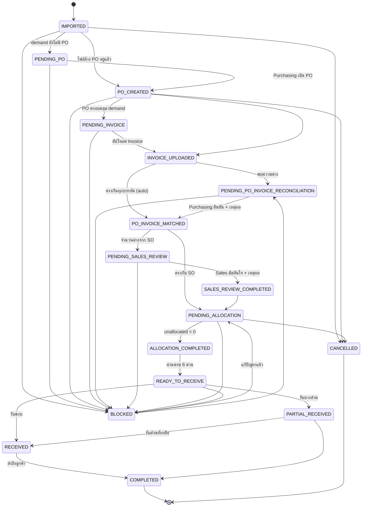

# 4. Workflow Status Diagram

## 1. สถานะกลาง 17 สถานะ (§8)

ทุก demand line (PR line, SO line) และทุก PO line ถือสถานะจากชุดเดียวกันนี้
สถานะถูก **คำนวณใหม่จากเอกสารจริงเสมอ** (`resolveStatus()` ใน
`lib/scm/status.ts`) แล้วเก็บลงคอลัมน์เพื่อให้ filter/index ได้ — เอกสารคือ
ความจริง คอลัมน์เป็นแค่ cache

| # | สถานะ | สี | ความหมาย |
|---|---|---|---|
| 1 | `IMPORTED` | เทา | นำเข้าแล้ว ยังไม่เริ่มกระบวนการ |
| 2 | `PENDING_PO` | เหลือง | รอเปิด PO / PO ยังไม่ครอบคลุม demand |
| 3 | `PO_CREATED` | น้ำเงิน | เปิด PO แล้ว |
| 4 | `PENDING_INVOICE` | เหลือง | รอ Invoice จาก Supplier |
| 5 | `INVOICE_UPLOADED` | น้ำเงิน | อัปโหลด Invoice แล้ว |
| 6 | `PENDING_PO_INVOICE_RECONCILIATION` | เหลือง | มีความต่าง รอ Purchasing ยืนยัน |
| 7 | `PO_INVOICE_MATCHED` | น้ำเงิน | PO/Invoice ตรงกันหรือได้รับการยืนยันแล้ว |
| 8 | `PENDING_SALES_REVIEW` | เหลือง | จำนวนต่างจาก SO รอ Sales ตัดสินใจ |
| 9 | `SALES_REVIEW_COMPLETED` | น้ำเงิน | Sales ตัดสินใจแล้ว |
| 10 | `PENDING_ALLOCATION` | เหลือง | รอจัดสรรให้ลูกค้า/คลัง |
| 11 | `ALLOCATION_COMPLETED` | น้ำเงิน | จัดสรรครบ (unallocated = 0) |
| 12 | `READY_TO_RECEIVE` | น้ำเงิน | ผ่านครบ 6 ด่าน คลังรับของได้ |
| 13 | `RECEIVED` | น้ำเงิน | รับของแล้ว |
| 14 | `PARTIAL_RECEIVED` | เหลือง | รับได้บางส่วน |
| 15 | `COMPLETED` | เขียว | ส่งถึงลูกค้าแล้ว |
| 16 | `BLOCKED` | แดง | ติดปัญหา มีเหตุผลกำกับ |
| 17 | `CANCELLED` | เทา | ยกเลิก |

## 2. State machine



## 3. กติกาการเปลี่ยนสถานะ (§21)

`canTransition(from, to)` บังคับว่า:

1. **เดินตามลำดับเท่านั้น** — ข้ามขั้นไม่ได้
   `canTransition("PO_CREATED", "READY_TO_RECEIVE") === false`
2. **BLOCKED / CANCELLED เข้าถึงได้จากทุกสถานะ** — ปัญหาเกิดได้ทุกจุด
3. **BLOCKED กลับเข้าสาย workflow ได้** เมื่อ exception ถูกแก้
4. **COMPLETED และ CANCELLED เป็นปลายทาง**

ครอบคลุมด้วยเทสต์ใน `tests/scm-status.test.ts`

## 4. ตารางเงื่อนไขการคำนวณสถานะ

`resolveStatus(facts)` ตัดสินตามลำดับนี้ (เจอเงื่อนไขแรกที่จริง = ได้สถานะนั้น):

| ลำดับ | เงื่อนไข | สถานะ |
|---:|---|---|
| 1 | `cancelled` | `CANCELLED` |
| 2 | `blocked` | `BLOCKED` |
| 3 | `shipped` | `COMPLETED` |
| 4 | `partialReceived` | `PARTIAL_RECEIVED` |
| 5 | `received` | `RECEIVED` |
| 6 | `allocationCompleted` | `READY_TO_RECEIVE` |
| 7 | `allocationRequired` | `PENDING_ALLOCATION` |
| 8 | `salesReviewRequired && !salesReviewDone` | `PENDING_SALES_REVIEW` |
| 9 | `salesReviewDone` | `SALES_REVIEW_COMPLETED` |
| 10 | `poInvoiceOpen` | `PENDING_PO_INVOICE_RECONCILIATION` |
| 11 | `poInvoiceApproved` | `PO_INVOICE_MATCHED` |
| 12 | `hasInvoice` | `INVOICE_UPLOADED` |
| 13 | `poQuantity < requiredQuantity` (หรือ = 0) | `PENDING_PO` |
| 14 | อื่น ๆ | `PENDING_INVOICE` |

## 5. Progress stepper บนหน้าเอกสาร

หน้ารายละเอียดเอกสาร (`/scm/trace/…`) แสดงขั้นตอนตาม §19:

```
SO/PR → PO → Invoice → PO vs Invoice → Sales review → Allocation → Receiving → Shipment
```

โดยระบายสี: **เขียว** = ผ่านแล้ว, **น้ำเงิน** = กำลังทำ, **เทา** = ยังไม่เริ่ม,
**แดง** = ติดปัญหาที่ขั้นนั้น
