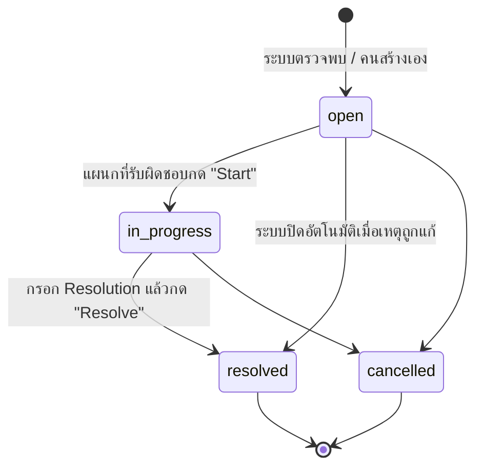

# 7. Exception Handling

## 1. หลักการ

ทุก exception มีครบ 5 อย่างตาม §15:

**Reason + Responsible Department + Action + Due Date + Status**

`lib/scm/exceptions.ts → raiseException()` เป็นทางเดียวที่สร้าง exception และ
เป็น **idempotent ต่อ (type, document)** — นำเข้าไฟล์ซ้ำหรือรัน reconciliation
ใหม่จะไม่สร้างรายการซ้ำในคิว

## 2. ชนิดของ Exception (20 ชนิด)

| Type | เกิดเมื่อ | Severity | ผู้รับผิดชอบ | Action ตั้งต้น |
|---|---|:--:|---|---|
| `SUPPLIER_SHORT` | Invoice qty < PO qty | high | Purchasing → Sales | ยืนยันจำนวนที่แก้ไข + เหตุผล |
| `SUPPLIER_OVER` | Invoice qty > PO qty | medium | Purchasing → Sales | ตัดสินใจว่าส่วนเกินไปไหน |
| `WRONG_PRODUCT` | Supplier ส่งสินค้าผิด | high | Purchasing | ติดต่อ Supplier / ปฏิเสธ Invoice |
| `PRICE_MISMATCH` | ราคา Invoice ≠ PO | high | Purchasing | ตรวจสอบราคาและอนุมัติ/ปฏิเสธ |
| `UNIT_MISMATCH` | หน่วยไม่ตรง master | medium | Admin | เพิ่ม conversion ที่ Master data → Units |
| `PRODUCT_CODE_UNKNOWN` | รหัสสินค้าไม่พบ | medium | Admin | เพิ่มสินค้าใน master หรือแก้ไฟล์ |
| `INVOICE_WITHOUT_PO` | Invoice ไม่ผูก PO | high | Purchasing | เลือก PO ที่ตรงกัน หรือปฏิเสธ Invoice |
| `PO_WITHOUT_SO` | PO line ไม่มี demand | medium | Sales | ผูกกับ SO หรือวางแผนเป็น stock |
| `SO_WITHOUT_PO` | SO ยังไม่มี PO | medium | Purchasing | เปิด PO ที่ Order management |
| `PARTIAL_DELIVERY` | ส่งไม่ครบ / บรรทัดหายจาก Invoice | high | Purchasing | ยืนยันจำนวนที่ได้จริง |
| `CANCEL_ORDER` | ยกเลิกคำสั่งซื้อ | medium | Sales | แจ้งลูกค้าและปิดเอกสาร |
| `CUSTOMER_REJECT` | ลูกค้าไม่รับสินค้า | high | Sales | หาลูกค้าใหม่หรือเข้าคลัง |
| `EXCESS_STOCK` | มีของเข้าคลังแทนที่จะไปลูกค้า | low | Warehouse / Sales | เก็บและวางแผนขาย |
| `MOQ` | สั่งเกินเพราะ MOQ | low | Sales | ตัดสินใจว่าส่วนเกินไปไหน |
| `PACK_SIZE` | สั่งเกินเพราะขนาดแพ็ค | low | Sales | เหมือน MOQ |
| `WEIGHT_BASED_PRODUCT` | สินค้าต้องชั่งรายชิ้น | medium | Warehouse | ชั่งทุกชิ้นและจ่ายให้ลูกค้า |
| `MULTI_CUSTOMER_ALLOCATION` | ต้องแบ่งให้หลายลูกค้า | low | Sales | จัดสรรที่หน้า Allocation |
| `DUPLICATE_DOCUMENT` | เอกสารซ้ำ | medium | ตามที่เกิด | ตรวจสอบและเลือกฉบับที่ถูก |
| `INVALID_DATE` | วันที่ไม่ถูกต้อง | low | ตามที่เกิด | แก้ไฟล์นำเข้า |
| `OTHER` | อื่น ๆ | medium | ตามที่ระบุ | ตามที่ระบุ |

## 3. วงจรชีวิต



**การปิดอัตโนมัติ** — เมื่อ workflow เดินหน้า ระบบปิด exception ที่เกี่ยวข้องเอง:

| เหตุการณ์ | ปิด exception ของ |
|---|---|
| Purchasing ยืนยันจำนวนที่แก้ไข | `po_line` นั้น (`Confirmed at X (reason)`) |
| Sales ตัดสินใจเรื่องความต่าง | `so_line` นั้น (`<decision> — <reason>`) |
| Allocation completed | `po_line` นั้น (`Allocation completed.`) |
| Invoice ถูกผูกกับ PO | `INVOICE_WITHOUT_PO` ของ invoice นั้น |
| Receiving completed | ทุก exception ของ PO line ในใบนั้น |

## 4. กรณีพิเศษที่สเปคระบุ (§15) และวิธีที่ระบบรองรับ

| กรณี | ระบบทำอะไร |
|---|---|
| Supplier ส่งไม่ครบ | recon `short` → บังคับเหตุผล → corrected qty → Sales review → allocation ตามจำนวนจริง |
| Supplier ส่งเกิน | recon `over` → Sales เลือกเพิ่มให้ลูกค้า หรือเข้าคลัง (บังคับ location/reason/dept) |
| Supplier ส่งสินค้าผิด | บรรทัด Invoice ที่จับคู่ PO ไม่ได้ → `INVOICE_WITHOUT_PO` + ปฏิเสธ Invoice ได้ |
| Price ไม่ตรง | `priceStatus` higher/lower → บังคับ price reason → workflow Pending → Review → Approved/Rejected |
| Unit ไม่ตรง | นำเข้าไม่ผ่านถ้าแปลงไม่ได้ / แปลงให้พร้อม warning ถ้ามี conversion |
| Product Code ไม่ตรง | นำเข้าไม่ผ่าน + ระบุรหัสที่มีปัญหา |
| Invoice ไม่มี PO | exception + ห้าม verify จนกว่าจะผูก PO |
| PO ไม่มี SO | exception ให้ Sales ตอนนำเข้า PO |
| SO ไม่มี PO | ขึ้นบนกระดาน Order management + แจ้งเตือน Purchasing |
| Partial Delivery | `PARTIAL_RECEIVED` + receiving line status `partial` |
| Cancel Order | PO status `cancelled` → ทุก line กลายเป็น `CANCELLED` |
| Customer Reject | Sales บันทึก `customerAccepted = false` + เหตุผล |
| Excess Stock | allocation line target `warehouse` → exception `EXCESS_STOCK` |
| MOQ / Pack Size | บังคับ `adjustmentReason` ตอนสร้าง PO + exception ให้ Sales |
| Weight-based Product | บันทึกน้ำหนักรายชิ้น + จ่ายชิ้นต่อลูกค้า |
| Multiple Customer Allocation | allocation หลายบรรทัดต่อ PO line เดียว |

## 5. หน้าจอ Exception (§15)

```
Exception management
Short and over deliveries, price and unit mismatches, orphan documents,
excess stock — each with an owner and an action.

┌ Open 3 🔴 ┐┌ In progress 0 ┐┌ Overdue 0 ┐┌ Total listed 3 ┐

Code     │Exception              │Document │Responsible │Action           │Due   │Status
─────────┼───────────────────────┼─────────┼────────────┼─────────────────┼──────┼───────
EXC-0001 │Supplier delivered short│PO-0002 │[Purchasing▾]│Confirm the      │[1 Oct]│Open
🔴 high  │Invoice qty 30 vs PO 36 │po_line  │            │corrected qty    │      │[Start]
                                                                                  [Resolution…]
                                                                                  [Resolve]
EXC-0002 │Minimum order quantity  │PO-0003  │[Sales     ▾]│Decide where the │[10 Oct]│Open
⚪ low   │ordered 24 vs demand 18 │po_line  │            │extra 6 tins go  │      │
EXC-0003 │Weight-based product    │PO-0004  │[Warehouse ▾]│Weigh every piece│[2 Oct]│Open
🟡 medium│king crab               │po_line  │            │at receiving     │      │
```

การเปลี่ยน responsible department, due date และ status ถูกบันทึกลง audit trail
ทุกครั้ง

## 6. การแจ้งเตือนที่คู่กัน (§16)

`lib/scm/notify.ts` เขียนแจ้งเตือนไปยังแผนกที่ต้องลงมือ:

| Workflow | แผนก | แจ้งเตือน |
|---|---|---|
| นำเข้า demand ที่ยังไม่มี PO | Purchasing | New demand waiting for a purchase order |
| นำเข้า SO | Purchasing | N sales order(s) imported |
| สร้าง PO | Purchasing | PO-X issued to <supplier> |
| อัปโหลด Invoice | Purchasing | Invoice X needs verification |
| PO/Invoice ไม่ตรง | Purchasing | PO-X: N line(s) do not match the invoice |
| ปฏิเสธ recon | Purchasing | PO-X: reconciliation rejected (critical) |
| จำนวนต่างจาก SO | Sales | PO-X: N customer order(s) need a decision |
| Sales review ครบ | Sales | PO-X: all differences reviewed |
| Allocation completed | Warehouse | PO-X: allocation completed |
| รับของแล้ว | Sales | PO-X received (RCV-Y) |
| ส่งของแล้ว | Sales | SHP-X shipped to <customer> |

แจ้งเตือนที่ยังไม่อ่านแสดงบน `/scm` แยกตามแผนกของผู้ใช้ (admin/management
เห็นทุกแผนก)
