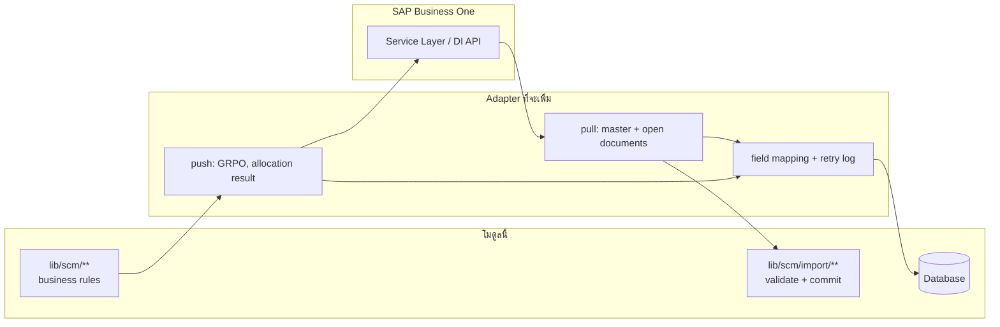

# 12. ERP / SAP Business One Integration

> ข้อกำหนดสุดท้ายของสเปค: *"ระบบต้องออกแบบให้สามารถขยายในอนาคตเพื่อเชื่อมต่อกับ
> SAP Business One หรือ ERP ได้ โดยไม่ต้องออกแบบ Database ใหม่ทั้งหมด"*

## 1. สิ่งที่ออกแบบไว้แล้วเพื่อรองรับ

| การตัดสินใจ | ทำไมมันช่วยตอนต่อ ERP |
|---|---|
| **เลขเอกสารเป็นคีย์ธุรกิจ** — `poNumber`, `soNumber`, `prNumber`, `invoiceNumber`, `code` ของ supplier/customer/product เป็น unique ทั้งหมด | ERP ใช้เลขเดียวกัน จับคู่ได้โดยไม่ต้องใช้ id ภายใน |
| **ไม่ใช้ native enum** | เพิ่มสถานะที่ ERP มีเพิ่มได้โดยไม่ต้อง migrate ชนิดข้อมูล |
| **`baseQuantity` ทุกบรรทัด** | SAP B1 ทำงานด้วยหน่วยคลังเป็นหลัก ข้อมูลพร้อมอยู่แล้ว |
| **ตารางแยกหัว/บรรทัด** (`*_lines`) | ตรงกับโครงสร้าง `ODOC` / `DOC1` ของ SAP B1 |
| **`import_batches`** | มีที่เก็บ payload + ผลตรวจอยู่แล้ว ใช้เป็น log ของ sync ได้ |
| **`audit_logs`** | มีร่องรอยการเปลี่ยนแปลงครบ ใช้เป็นแหล่ง delta ได้ |
| **Domain layer แยกจาก Prisma** | กฎธุรกิจไม่ผูกกับที่มาของข้อมูล — ข้อมูลจะมาจากไฟล์หรือ ERP ก็ใช้กฎเดียวกัน |
| **`Scm` prefix + `@@map`** | ตารางจริงชื่อมาตรฐาน ต่อ view/ETL ได้ตรงไปตรงมา |

## 2. การจับคู่กับ SAP Business One

| โมดูลนี้ | SAP Business One | หมายเหตุ |
|---|---|---|
| `suppliers` | `OCRD` (CardType = S) | `code` ↔ `CardCode` |
| `customers` | `OCRD` (CardType = C) | `code` ↔ `CardCode` |
| `products` | `OITM` | `prCode` ↔ `ItemCode` |
| `units` / `unit_conversions` | `OUOM` / `OUGP` | UoM group |
| `purchase_requests` | `OPRQ` / `PRQ1` | Purchase Request |
| `purchase_orders` | `OPOR` / `POR1` | Purchase Order |
| `sales_orders` | `ORDR` / `RDR1` | Sales Order |
| `invoices` | `OPCH` / `PCH1` | A/P Invoice |
| `receiving` | `OPDN` / `PDN1` | Goods Receipt PO |
| `shipment` | `ODLN` / `DLN1` | Delivery |
| `allocation` | ไม่มีตรง ๆ | ยังคงอยู่ฝั่งนี้ (ดูข้อ 4) |
| `po_invoice_reconciliation` | ไม่มีตรง ๆ | ยังคงอยู่ฝั่งนี้ |
| `so_po_reconciliation` | ไม่มีตรง ๆ | ยังคงอยู่ฝั่งนี้ |

## 3. รูปแบบการเชื่อมต่อที่แนะนำ



**หลักการ:** adapter แปลง payload ของ ERP ให้อยู่ในรูปเดียวกับที่
`lib/scm/import/validate.ts` รับอยู่แล้ว แล้วเรียก `commit*Import()` ตัวเดิม —
กฎการตรวจสอบ การผูกเอกสาร การสร้าง exception และการเขียน audit ทำงานเหมือนเดิม
ทั้งหมด ไม่ต้องเขียนใหม่

```ts
// รูปแบบที่ adapter จะเรียก (สัญญาเดิม ไม่ต้องแก้ domain)
const prepared = await validatePoRows(rowsFromSapServiceLayer);
await commitPoImport(prepared, "SAP:OPOR:sync", systemActor);
```

## 4. ขอบเขตงานที่ยังอยู่ฝั่งนี้

ERP ทั่วไปไม่มี 3 อย่างนี้ ซึ่งเป็นเหตุผลที่โมดูลนี้มีอยู่:

1. **PO/Invoice reconciliation ที่บังคับเหตุผล** — SAP มี GRPO variance แต่ไม่บังคับ
   ชุดเหตุผลตามที่ธุรกิจนี้ต้องการ
2. **Sales decision บนความต่าง** — การตัดสินว่าลูกค้ารายไหนถูกตัด ลูกค้ายอมรับ
   หรือไม่ เป็นกระบวนการเฉพาะของธุรกิจ
3. **Allocation รายชิ้นตามน้ำหนัก** — การจ่ายปลาตัวที่ 3 ให้ลูกค้า A เป็นสิ่งที่
   ERP มาตรฐานไม่ครอบคลุม

แนวทางที่แนะนำ: ให้ ERP เป็นระบบบัญชี/สต็อกหลัก (master + เอกสารการเงิน)
และให้โมดูลนี้เป็นระบบปฏิบัติการหน้างาน (reconciliation + allocation) โดยส่ง
ผลลัพธ์ที่สรุปแล้วกลับเข้า ERP

## 5. สิ่งที่ต้องเพิ่มเมื่อจะต่อจริง (ไม่ต้องแก้ schema เดิม)

| งาน | รายละเอียด |
|---|---|
| ตาราง `erp_links` | `entity`, `entityId`, `erpSystem`, `erpDocEntry`, `erpDocNum`, `syncedAt`, `syncStatus` — ตารางใหม่ล้วน ไม่แตะของเดิม |
| Adapter | `lib/scm/erp/sap-b1.ts` — pull master + open PO/SO, push GRPO |
| ตารางคิว sync | ใช้ `import_batches` ที่มีอยู่ หรือเพิ่ม `erp_sync_jobs` ถ้าต้องการ retry แยก |
| ตั้งค่า | เพิ่ม key ใน `Setting` (`erpBaseUrl`, `erpCompanyDb`, …) — ไม่ต้อง migrate |
| สิทธิ์ | เพิ่ม permission `erp.sync` ใน matrix เดิม |

## 6. การย้ายไป PostgreSQL

โมดูลนี้ใช้ SQLite ในการพัฒนาแต่ไม่ผูกกับมัน:

1. เปลี่ยน `provider = "postgresql"` ใน `prisma/schema.prisma`
2. ตั้ง `DATABASE_URL`
3. `npx prisma migrate deploy`

ไม่มี native enum, ไม่มี raw SQL เฉพาะ SQLite, ไม่มีการพึ่งพา
`json` type — ทุก payload เก็บเป็น String ที่ `JSON.stringify` เอง
ข้อควรระวังเดียวคือ `unit_conversions.key` ที่ออกแบบมาเพื่อเลี่ยงพฤติกรรม
NULL-in-unique ของ SQLite — บน PostgreSQL จะใช้ composite unique ธรรมดาแทนได้
แต่ไม่จำเป็นต้องเปลี่ยน
